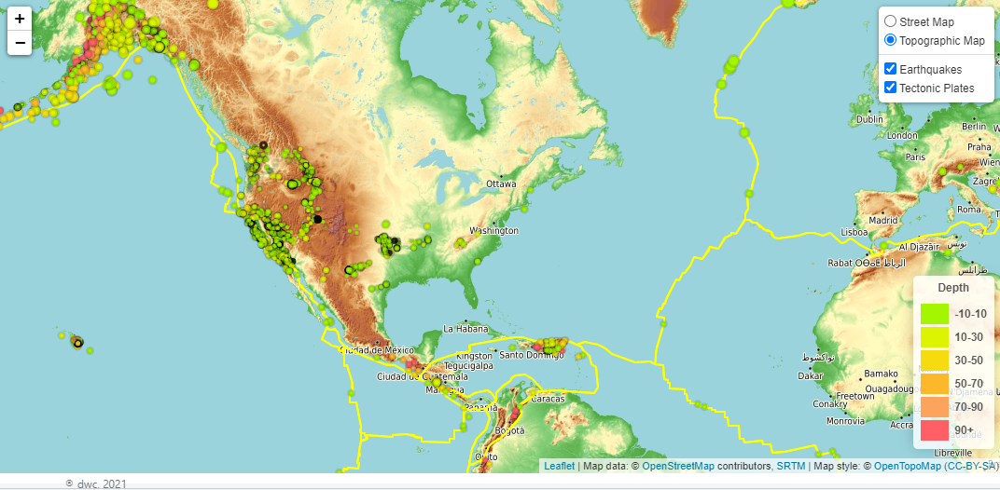
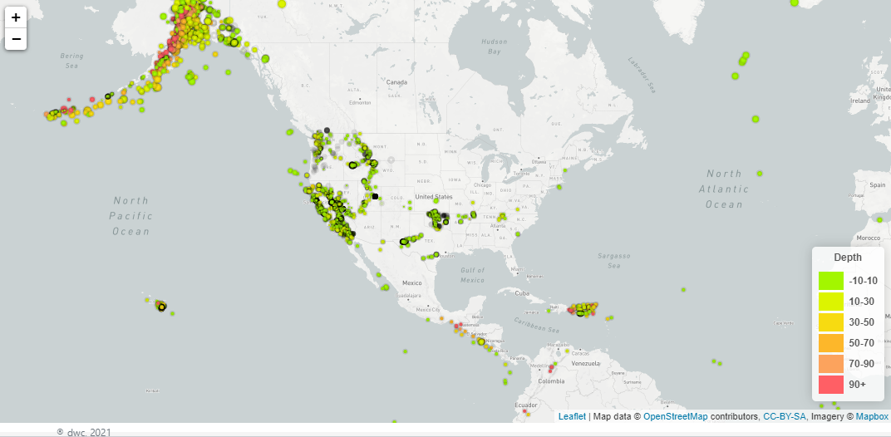
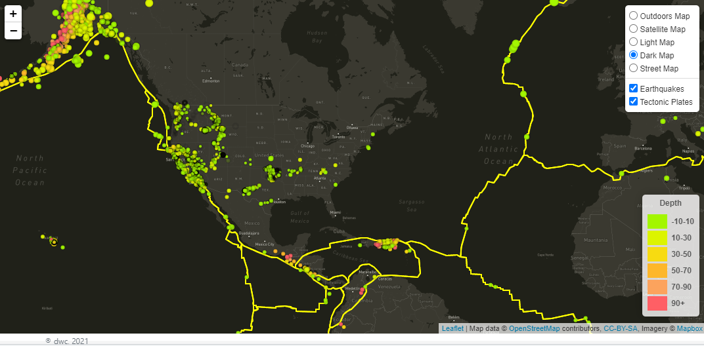

# Visualizing Data with Leaflet

Visualize Earthquake data to allow USGS to better educate the public and other government organizations (and hopefully secure more funding) on issues facing our planet.
  
<b>
View preview here: <a target="_blank" href="https://rb25s13.github.io/leaflet-challenge/">https://rb25s13.github.io/leaflet-challenge/</a>
</b> 

__________________

Tools, Languages, & Libraries Utilized

<li>d3</li>
<li>Leaflet</li>
<li>jQuery</li>
<li>Bootstrap</li>
<li>OpenStreetMap API</li>
<li>Mapbox API</li>
<li>HTML/CSS</li>
<li>VS Code</li>

### Sources:
Earthquakes: <a target="_blank" href="https://earthquake.usgs.gov/earthquakes/feed/v1.0/geojson.php">https://earthquake.usgs.gov/earthquakes/feed/v1.0/geojson.php</a>

Tectonic Plates: <a target="_blank" href="https://github.com/fraxen/tectonicplates">https://github.com/fraxen/tectonicplates</a>

<!-- ### Built With:

* [Leaflet.js](https://leafletjs.com/)
* [d3.js](https://d3js.org/)
* [Bootstrap](https://getbootstrap.com)
* [OpenStreetMap](https://www.openstreetmap.org/)
* [Mapbox](https://www.mapbox.com/) -->

### Contents:

        /static - folders for js and css
                /css - style.css for custom styles
                /js - logic.js: code for preview using openstreetmap w/o mapbox
                /img - screenshots for readme
        /Leaflet-Step-1 - mapbox map with Earthquake Markers
        /Leaflet-Step-2 - same as above + layer control and Tectonic Plate Lines

NOTE: `config.js` file containing mapbox API_KEY is needed to generate the maps in Step-1 and Step-2

        // API key
        const API_KEY = 'API key';

## Preview: OpenStreetMap w/o Mapbox - no api needed

## Step-1: All Earthquakes in the Last Month using Mapbox
- Color of cirle is based on the depth of the earthquake
- Radius of circle is based on the magnitude of the earthquake

## Step-2: Step-1 with extra features
- Added Layer control
- Added different base maps to choose from
- Added Tectonic Plates layer

