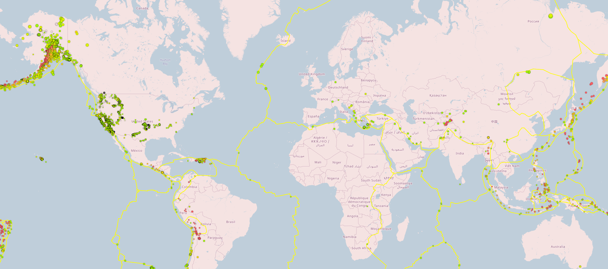

# Visualizing Data with Leaflet

Visualize their data to allow them to better educate the public and other government organizations (and hopefully secure more funding) on issues facing our planet.

Data source: <a target="_blank" href="https://earthquake.usgs.gov/earthquakes/feed/v1.0/geojson.php">https://earthquake.usgs.gov/earthquakes/feed/v1.0/geojson.php</a>

View preview here: <a target="_blank" href="https://rb25s13.github.io/leaflet-challenge/">https://rb25s13.github.io/leaflet-challenge/</a> 

### Contents:

        /static - folders for js and css
                /css - style.css for custom styles
                /js - logic.js for code to read api and plot data

 

